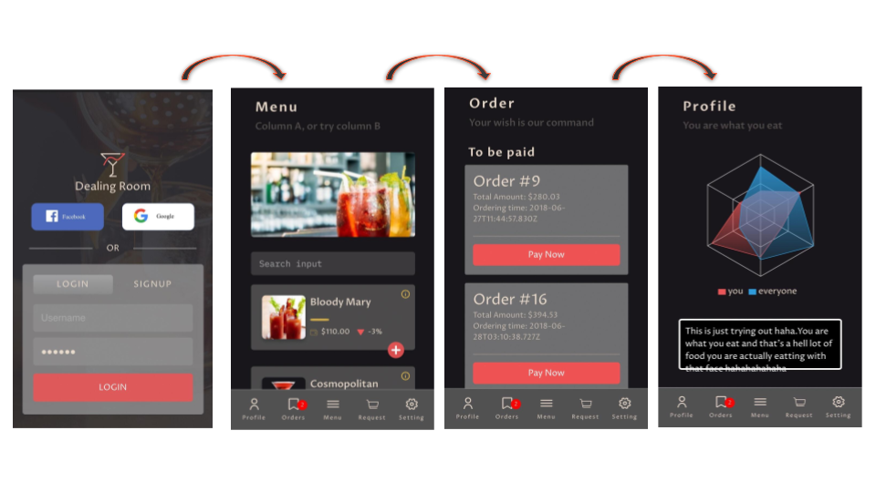

<span style="display:block;text-align:center">

   

</span>
  
  <div style="text-align:center">
DEALING ROOM TEMP LOGO
 </div> 
 
 
 # Objective
State the mission of the web app here!


 CAPSTONE PROJECT (Cohort 6) : 

  [Ivan Oung](https://github.com/ivanoung) 

  [Andrew Cheung](https://github.com/cheungdzinyung) 

  [Harisson Chan](https://github.com/harrixon) 

  [Judith Curtit](https://github.com/judithcurtit)


## Tools
 


## Prerequisites: 


There are things you need to install for the project. Follow below instructions to get started.

```
yarn install
```

Please also add an .env file in the root folder with the following sentence in order for https to work properly. 
```
HTTPS=true
```


## Project at a glance


 

## Project Update Log

Date | Description | Status
-------------- | ----------------------- | ---------------------
May 23 | Git Repo initiation
May 24 | Folder Structure | create-react-app
May 24 | database | migration, seeding files
May 25 | Tasks List (spreadsheet)
May 28 | Tasks List added in trello
May 28 | READme update
May 29 | Split folders into frontend and backend
May 29 | React Routers
May 29 | API routes | definition
May 30 | README update | front-end flow
May 30 | Routes | Description
May 31 | Blueprint UI | Scss implementation
Jun 4  | Frontend development
Jun 4  | Backend development
Jun 5  | Display page | in progress
Jun 5  | Routes/Service (Users) | in progress
Jun 5  | Converted all backend files to Typescript


## Deployment
The project will be deployed on AWS.


## Links

- link to dealingroom website
* [ROME](https://rometools.github.io/rome/) - Used to generate RSS Feeds


## Contributing

Please feel free to contact us if you're interested in contributing!

### Pending Features
* Additional payment methods
* Facebook Login
* Tests case

